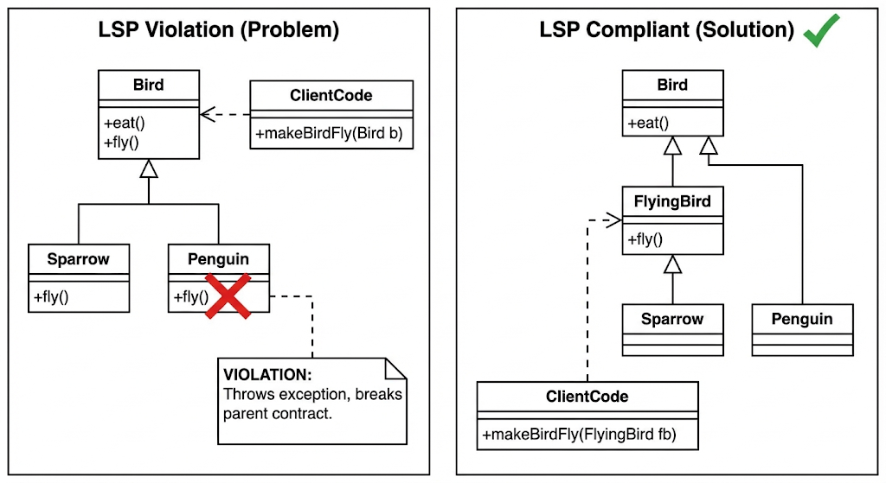
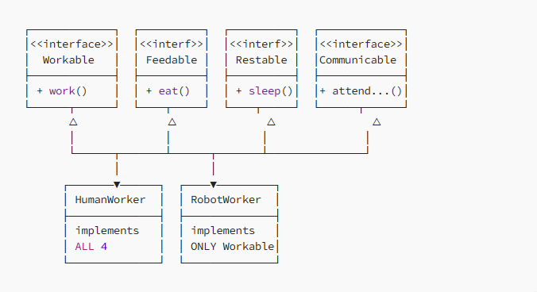

# SOLID Principles: A Practical Guide

> **Core Philosophy:** SOLID principles aren’t about perfect code. They’re about keeping systems maintainable as they grow. Think of them as guardrails that make refactoring feel less like surgery and more like editing.

## 📚 What You'll Learn
* What each principle actually means.
* Real code examples (Bad vs. Good).
* When to apply them (and when not to).
* How to detect "code smells."

---

## 🚀 The 5 Principles

## 1. S — Single Responsibility Principle (SRP)
**The Rule:** A class should have one, and only one, reason to change.

#### ❌ The Problem
The `InvoiceService` handles logic, database operations, and email notifications.
* *Changes to tax rules?* Edit `InvoiceService`.
* *Switching DBs?* Edit `InvoiceService`.
* *Email config?* Edit `InvoiceService`.

```java
public class InvoiceService {
    public void createInvoice(Invoice invoice) {
        // 1. Validate
        if (invoice.getItems().isEmpty()) throw new IllegalArgumentException("No items");
        
        // 2. Calculate pricing
        BigDecimal tax = subtotal.multiply(new BigDecimal("0.18"));
        
        // 3. Save to database
        jdbcTemplate.update("INSERT INTO invoices...", ...);
        
        // 4. Send email
        emailClient.send(invoice.getCustomerEmail(), "Invoice Created");
    }
}
```

#### ✅ The Solution 
Delegate responsibilities to dedicated classes.

```java
public class InvoiceService {
    private final InvoiceValidator validator;
    private final InvoiceCalculator calculator;
    private final InvoiceRepository repository;
    private final NotificationSender notificationSender;
    
    public void createInvoice(Invoice invoice) {
        validator.validate(invoice);
        calculator.calculateTotals(invoice);
        repository.save(invoice);
        notificationSender.sendInvoiceCreated(invoice);
    }
}
```

When to apply :
* Class exceeds 300 lines. 
* Class name contains generic terms like "Manager", "Handler", or "Util". 
* Changes in one area break unrelated tests.

---


## 2. O — Open/Closed Principle (OCP)
**The Rule:** Open for extension, closed for modification. Add new features by creating new classes, not editing old ones.

#### ❌ The Problem
Adding PLATINUM tier means editing this method. Every change risks breaking existing discounts.

```java
public class DiscountService {
    public BigDecimal applyDiscount(Customer customer, BigDecimal price) {
        if (customer.getTier() == Tier.GOLD) {
            return price.multiply(new BigDecimal("0.8"));
        } else if (customer.getTier() == Tier.SILVER) {
            return price.multiply(new BigDecimal("0.9"));
        } else if (customer.getTier() == Tier.STUDENT) {
            return price.multiply(new BigDecimal("0.85"));
        }
        return price;
    }
}
```

#### ✅ The Solution
Delegate responsibilities to dedicated classes.


```java
public interface DiscountPolicy {
    BigDecimal apply(Customer customer, BigDecimal price);
}

public class GoldDiscountPolicy implements DiscountPolicy {
    public BigDecimal apply(Customer customer, BigDecimal price) {
        return price.multiply(new BigDecimal("0.8"));
    }
}
```


```java
public class DiscountService {
    private final Map<Tier, DiscountPolicy> policies;
    
    public BigDecimal applyDiscount(Customer customer, BigDecimal price) {
        DiscountPolicy policy = policies.get(customer.getTier());
        return policy.apply(customer, price);
    }
}
```

**Add a new tier?**  Just create PlatinumDiscountPolicy. DiscountService never changes.

When to apply :
* You have lots of if/else or switch statements based on types.
* You frequently add new variants of logic.
* You need a plugin architecture.
---

## 3. L — Liskov Substitution Principle (LSP)
**The Rule:** If you replace a parent object with a child object, your application shouldn't break or behave weirdly.

#### ❌ The Problem
You create a Penguin class. Penguins are birds, so you extend Bird. But wait—penguins can't fly.

```java
// 1. The Standard Class
class Bird {
    public void fly() {
        System.out.println("I am flying high!");
    }
}

// 2. The Child Class
class Penguin extends Bird {
    @Override
    public void fly() {
        // BREAKS LSP!
        // The parent said "I can fly", but the child says "Error!"
        throw new UnsupportedOperationException("Help! I cannot fly!");
    }
}

// 3. The Code that crashes
public void makeBirdFly(Bird bird) {
    bird.fly();
}

// If I pass a Sparrow, it works.
// If I pass a Penguin, THE APP CRASHES.
```

**Why is this bad?** The function makeBirdFly trusts that if it gets a Bird, it can call .fly(). 
The Penguin betrayed that trust. You can no longer swap (substitute) a Penguin in place of a Bird safely.

#### ✅ The Solution
Don't force the Penguin to lie about flying. Change the hierarchy so the "Flying" contract is separate.



```java
// 1. Base Class (Things all birds do)
class Bird {
    public void eat() { }
}

// 2. Separate Interface for Flying
class FlyingBird extends Bird {
    public void fly() {  }
}

class Penguin extends Bird {
    // Penguin is just a Bird, it is NOT a FlyingBird.
    // It doesn't have the fly() method at all.
}
```

Now, your code explicitly asks for a FlyingBird if it needs to fly. You can never accidentally pass a Penguin to a flight simulator.

---

## 4. I — Interface Segregation Principle (ISP)
**The Rule:** Many small interfaces are better than one large interface. Don’t force clients to implement methods they don’t use.

#### ❌ The Problem
A Robot is forced to implement eat() because it implements Worker.

```java
public interface Worker {
    void work();
    void eat();
    void sleep();
    void attendMeeting();
    void submitTimesheet();
}
```
```java
public interface Worker {
    void work();
    void eat();
}

public class RobotWorker implements Worker {
    public void work() {  }
    public void eat() { throw new UnsupportedOperationException(); } // Violation!
}
```

#### ✅ The Solution
Split interfaces based on capabilities.



```java
public interface Workable { void work(); }
public interface Feedable { void eat(); }
public interface Restable { void sleep(); }
public interface Communicable { void attendMeeting(); }
```

```java
public class HumanWorker implements Workable, Feedable, Restable, Communicable {
    // Implements all
}
public class RobotWorker implements Workable {
    public void work() { /* ... */ }
    // Clean! No unused methods
}
```

When to apply :
* Implementations are throwing UnsupportedOperationException.
* Interfaces have >8 methods.
* Different clients use distinct subsets of the interface.
* ❌ Don’t over-split if all clients use all methods


---

## 5. D — Dependency Inversion Principle (DIP)
**The Rule:** Depend on abstractions, not concrete implementations.

#### ❌ The Problem
High-level business logic shouldn’t know about low-level details like which database you’re using.

```java
public class OrderService {
    // Hard dependency - hard to test, hard to swap
    private MySQLDatabase database = new MySQLDatabase();
    private SmtpEmailSender emailSender = new SmtpEmailSender();

    public void placeOrder(Order order) {
        database.save(order);
    }
}
```

* Cannot test without real database
* Cannot test without email server
* Cannot switch to PostgreSQL or SendGrid

#### ✅ The Solution
Inject dependencies via interfaces.


```java
public interface OrderRepository {
    void save(Order order);
}
```
```java
public interface EmailService {
    void sendOrderConfirmation(Order order);
}
```
```java
public class OrderService {
    private final OrderRepository repository;
    private final EmailService emailService;

    public OrderService(OrderRepository repository, EmailService emailService) {
        this.repository = repository;
        this.emailService = emailService;
    }

    public void placeOrder(Order order) {
        repository.save(order);
        emailService.sendOrderConfirmation(order);
    }
}
```

#### Easy Testing : 
```java
@Test
public void shouldPlaceOrder() {
    OrderRepository mockRepo = mock(OrderRepository.class);
    EmailService mockEmail = mock(EmailService.class);
    OrderService service = new OrderService(mockRepo, mockEmail);
    
    service.placeOrder(order);
    
    verify(mockRepo).save(order);
}
```

When to apply :
* Need multiple implementations
* Want isolated testing
* Infrastructure details change
---


